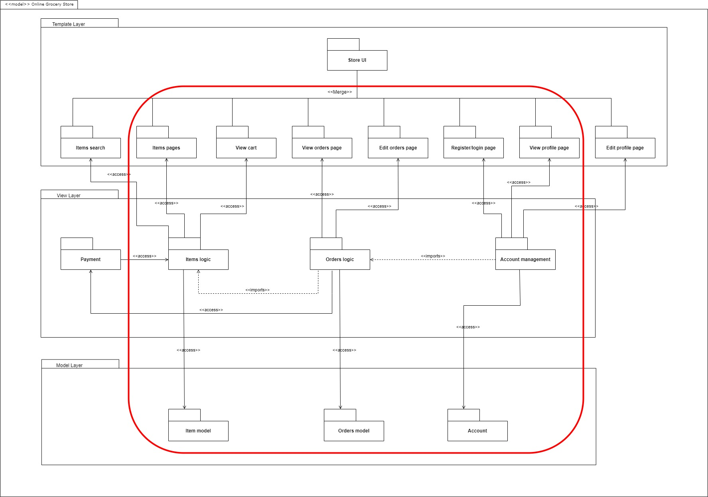

### What is this project?
This project is created as the final assignment of the Launching into Cyber Security module of the University of Essex Online. 
This application is based on the proposal essay, which is located in ```django_oss/shop/static/essay/OSS_Proposal.doc```

### What is in this project?
The original full package diagram is included in the essay. 
Below is a picture of the parts of the package diagram that are realized in this project.
It must be noted that for now editing a user is only possible by an admin and not the user itself!



### How to run this project?
This project is already provided with a MySQL database that has some data in it. 
Next to that, it is possible to add new data via the admin panel.
There will be two instructions on running this project, one through codio (specified by the University of Essex) and one instruction to start without data from scratch.

### Codio instructions
1. Open a terminal, via Ctrl + shift + alt or via ```Tools > Terminal```
2. Start the virtual environment with the following command:
    ```source ./env/bin/activate```
3. Go into the project folder:
    ```cd django_oss```
4. Run the server and bind it on port 8000 with the following command:
    ```python manage.py runserver 0.0.0.0:8000```
5. Set codio embedded browser to use the "Box URL"-setting and "New Browser Tab"-setting
6. Click on the embedded browser from codio
7. The Online Shopping System is now useable

### Clean install
1. Remove the env folder from the project and db.sqlite3
2. From the parent folder ```django_oss``` create a new virtualenv with the following command
    ```virtualenv env```
3. Start the virtual environment with the following command:
    ```source ./env/bin/activate```
4. Go into the project folder:
    ```cd django_oss```
5. Install all project dependencies from the requirements.txt file in this new virtualenv
    ```pip install -r requirements.txt```
6. Build the layout of the database using 
    ```python manage.py makemigrations shop```
7. Build the (empty) database via
    ```python manage.py migrate```
8. Run the server and bind it on port 8000 with the following command:
    ```python manage.py runserver 0.0.0.0:8000```
9. Use an internet browser to go to ```127.0.0.1:8000```
10. The Online Shopping System is now "useable", although data must be provided first
11. Create an admin via the following command:
    ```python manage.py createsuperuser```
12. Manually relate the new admin user in the admin panel to a Customer

### Adding Data via the Admin interface
This project is built on the Django framework and utilizes the Django admin functionalities.
The Django admin provides a User Interface where registered models can be added, edited, or deleted.
To use the admin panel one must have access to an admin account (this is provided to the course professor in a separate file).
To create an admin from a clean install visit step 11 from a clean install. The admin panel can be found at the following URL: ```hostedurl/admin```

### Using the Online Shopping System
The online shopping system's navigation is based on data provided by the database.
The Django application builds navigation links based on the different categories of the shop (e.g. 'fruits').
A clean install will need to add these manually (via the admin panel) before the application is usable.
After adding categories, the same Django admin interface can populate products.
This is the only data needed before the application can function as described in the package diagram.
Beware that creating an admin does not make the admin a customer (impossible via Django), and as the OSS does not support anonymous shopping, an admin must be manually assigned to a customer via the panel as described in step 12.
The codio demo tester is already assigned to a customer. Any newly signed-up user via the application will be made a customer (child class of user).
The entire shopping flows up until payment is programmed, checking out only completes an order in this demo application (without actually paying).
The code is designed to enable shipping, although it is out of scope for this assignment.

### Build in unit tests
This project has built-in unit tests to validate the correct working of the desired functionalities. 
These can be run from the virtualenv by following these steps:
1. Start the virtual environment with the following command:
    ```source ./env/bin/activate```
2. Go into the project folder:
    ```cd django_oss```
3. Run the tests:
    ```python manage.py test```

### Mitigated risks via Security-by-design
As stated in the OSS proposal, the Django framework provides a lot of tools out of the box to protect against wrongdoers. 
The following most noticeable preventive measures have been implemented in this application:
1. cross-site request forgery (built-in by Django)
2. SQL injection and other forms of injection (via the use of SQLAlchemy)
3. Malicious File uploads (via the use of SQLAlchemy and the Django version 3.2.22)
4. Regex DDoS (there is no use of regex in the application, so it is not vulnerable)
Note: as the professor of this course has been provided with the credentials of the demo application, do not use this demo in production!


### References:
The code references sources when it heavily inspires solutions provided by other sources than the author.
Note that this project is designed to create a generic template for any Online Shopping problem, there might be an overlap in source code with other programmers.
Noteworthy references:
The template is mostly provided by the following w3schools template: https://www.w3schools.com/w3css/tryw3css_templates_clothing_store.html
images:
Banana => https://images3.alphacoders.com/769/76997.jpg
Milk => https://ww2.kqed.org/app/uploads/sites/38/2016/03/milk-435295-1920x1280.png
Logo => https://img.freepik.com/free-vector/cute-shopping-cart-logo_23-2148453859.jpg?w=740&t=st=1698400336~exp=1698400936~hmac=3d6fa33fc7aa21b42e565ba66ef23e59bc25b1b383d2ea3b9fdcedea92bb62ea